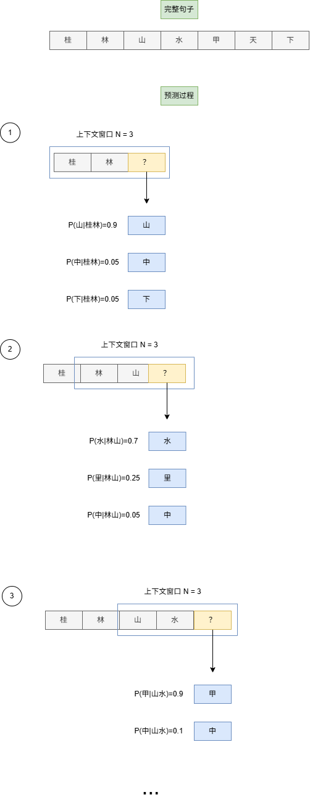

# 第一章 Build Your Own Small Language Model

## 语言模型是如何进行预测下一个词的？

简单来说，语言模型是通过根据当前给出句子，结合语境进行计算下一个词出现的概率分布，然后从中选择一个作为输出结果

比如：

输入: Jide was hungry so she went looking for...

可能的预测结果: food(0.75) snacks(0.2) leftovers(0.05)

最终大概率输出: Jide was hungry so she went looking for food

### 为什么采用概率进行预测？

- 采用概率的方式进行随机采样，可以改善内容生成的多样性，在大部分场景下，我们更希望同样的输出可以有不同的输出
- 模型有时可能会出错，采用概率的方式，可以通过执行多次生成，来得到一个更加合理的结果
- 尽管使用了概率，但仍然可以进行确定性的结果输出，可以通过每次都获取概率最大的词汇的方式(贪心)，来确保每次输入都可以得到同样的输出结果

## N-grams 模型

### 概述

N-grams 模型简单来说就是先统计一个词在与其他词进行组合的概率，也就是它们**一起出现的概率**，然后在给定的一个句子去生成完整的一段话时，就是基于前面进行统计计算的概率进行预测；

比如说，你经常会见到"这座山很高"的描述，但你很少见到"这座山很早上"的描述，那么在给定"这座山"这个上下文去生成完整的一段话时，预测得到"很高"接在后面的概率就比"早上"要高

### 统计公式

N-grams 模型的统计方式就是一个简单的**条件概率**公式

比如：
$$
P( 水秀 | 山清 )
$$
表示在"山清"一词在前面出现的前提下,"水秀"一词它一起组合的概率

这个概率的计算结果根据条件概率公式
$$
P(B|A) = \frac{Count(A B)}{Count(A)}
$$
得到:
$$
P( 水秀 | 山清 ) = \frac{Count(山清水秀)}{Count(山清)}
$$
其中`Count(山清水秀)`表示在文本集中"山清水秀"出现的次数,`Count(山清)`就是在文本集中出现的次数,`P( 水秀 | 山清 )`就是相对于其它词与"山清"进行组合出现的概率(在文本集中不只是"水秀"和"山清"一起组合出现)

### N 词统计

N-grams 中的"N"表示一个预测上下文窗口大小(由几个字组合)

当

- **N=1** 时,就只是统计单独一个词出现的概率, 比如"桂林山水甲天下",就将拆成"桂","林","山","水","甲","天","下"去进行统计
- **N=2** 时,统计连续**两个字**出现的概率,"桂林山水甲天下",将拆成"桂林","林山","山水","水甲","甲天","天下"
- **N=3** 时,统计连续**三个字**出现的概率,"桂林山水甲天下",将拆成"桂林山","山水甲","甲天下"去进行统计

现在换个例子,我们假设"白云山"在文本集中出现了600次,"白云"在文本集中出现了900次,而"白云下"只出现了10次,那么

"白云"和"山"一起出现的概率是
$$
P(山|白云) = \frac{Count(白云山)}{Count(白云)} = \frac{600}{900} = 0.66
$$
而"白云"和"下"一起出现的概率是
$$
P(下|白云) = \frac{Count(白云下)}{Count(白云)} = \frac{10}{900} = 0.011
$$
当在给定"白云"时,预测下一个出现的词相比于"下","山"的出现概率会更高,即输出"白云山"的概率将远大于"白云下"

### 图例

### N-grams 模型的局限性

1. 能力受语料库大小限制
2. 无法处理数据集中从未出现过的词汇预测
3. 因为能力受预料库大小限制,所以很容易出现高重复度的内容输出,生成不够多样
4. 缺乏上下文意识,N-grams只考虑句子的最后 **n - 1** 个词,忽略了长距离文本的依赖关系,生成的内容可能出现描述前后不一致的情况

## Transformer 模型

相比于 N-grams 模型, Transformer 模型生成的内容比前者更流利、上下文更相关的原因主要是以下两方面:

1.  Transformer 模型有**更大的上下文窗口**
2.  Transformer 模型基于**能够学习复杂和抽象内容的神经网络**

## 训练一个模型的过程

#### 机器训练简单过程描述

1. **预测** ：模型观察一串单词（ **输入** ），并尝试预测下一个标记（ **目标** ）
2. **比较** ：然后将预测结果与实际进行比较。模型预测与目标之间的差异将记录成一个 **Loss** 值 。高 **Loss** 值表示模型猜测错误，低 **Loss** 值表示猜测接近实际
3. **调整** ：基于这一损失，模型略微调整参数以提升下一次猜测。这种猜测、检查 **Loss** 值和调整的过程称为**优化**

#### 机器学习开发流程

1. 准备数据集(**data**): 收集资料->清洗数据,过滤有害或有偏见的内容->拆分和格式化数据,将内容分解成模型能理解的小单位
2. 训练(**Train**):使用一个现有的预训练模型,在此基础上进行训练(从零开始成本很高)
3. 微调(**Fine-tune**): 根据特定目的和期望行为进行微调,此步骤包括
	- 监督微调(**SFT**:**Supervised Fine-tuning**):预训练模型会在专门为 **目标任务**创建的较小且高质量的数据集上进一步训练
	- 人类反馈强化学习(**RLHF**:**Reinforcement Learning from Human Feedback**):这一阶段侧重于使 AI 的行为与**人类偏好**对齐，使其更具帮助性和无害性
4. 评估(**Evaluate**): 在正式发布给用户前,除了在**准确性，还包括性能、安全性、公平性和整体实用性**方面进行严格评估外,还需要进行**人类评估**
5. 部署(**Deploy**): 在满足评估标准后,进行部署投入实际应用,并在此期间进行**监控**
