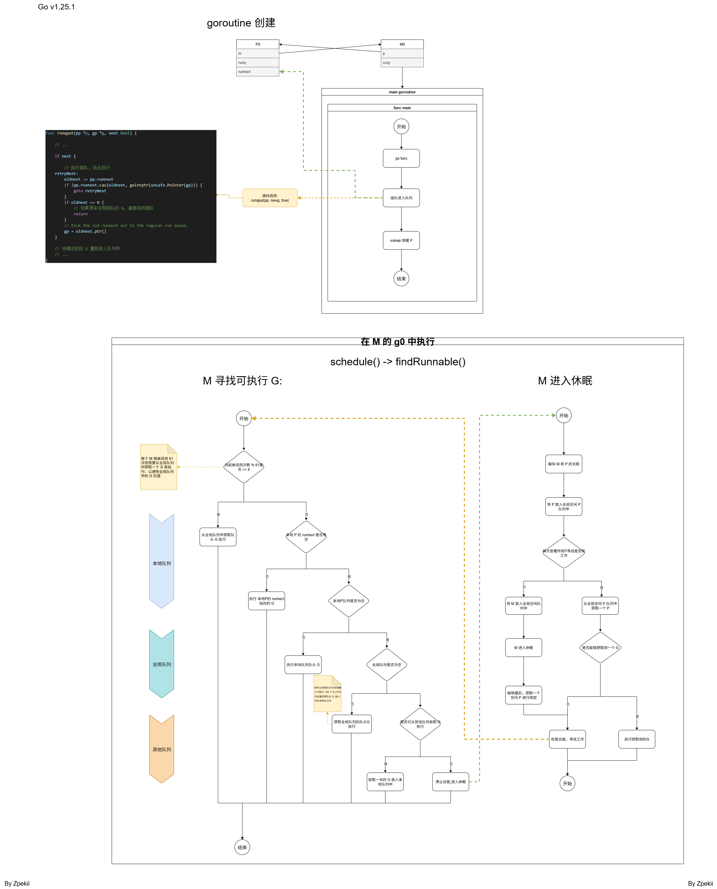
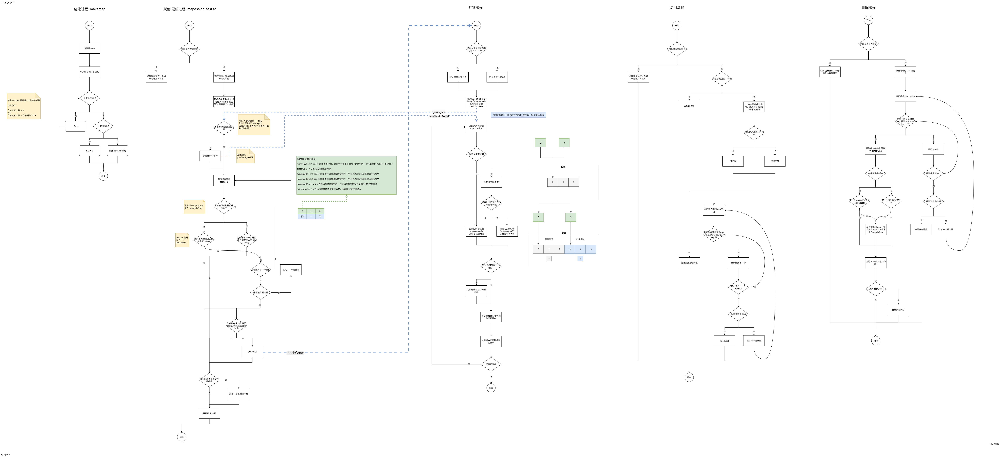
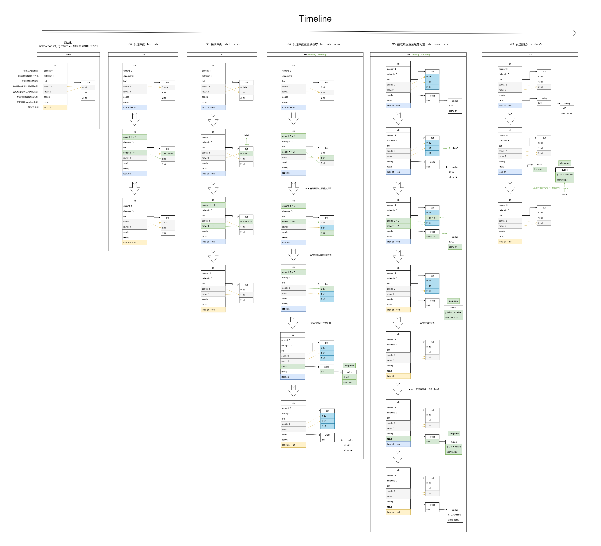

# GMP 模型

## G、M、P分别指什么

G 指的是 goroutine ；

- goroutine 的优势：
	- goroutine 更轻量，初始占用 2KB 的内存，但是可以进行动态扩容，理论上没有创建上限，可以创建上百万的 goroutine，但是仍会受到实际的物理内存大小约束
	- goroutine 是由 go 进行自动调度的用户态协程，不需要程序员自行管理，同时 goroutine 协程之间的切换不需要陷入内核态，并且保存的寄存器更少，切换更快

M 指的是执行用户代码的系统线程，因为用户代码可能会因执行系统调用而阻塞，所以 M 的数量可以是任意多个；

P 可以看作操作系统调度中的 CPU，上限由 `GOMAXPROCS` 配置决定

## 简要概括 GMP 模型调度过程

在程序运行后，首先会进行调度初始化，这个过程会会创建 M0 和 P0，接着再创建主 goroutine, 执行 main 方法，在 main 方法中就是执行的用户代码，

当用户代码中创建了goroutine，新的 goroutine 被标记为可运行态，然后会被尝试插队加入到一个 P 的本地队列中，如果所有 P 的本地队列都放不下了，才会尝试加入到全局队列中

接下来，

- 如果 goroutine 因为系统调用进入阻塞，
	1. 那么 goroutine 所属的 M 会进行解绑 P，然后尝试唤醒或创建一个新的 M 继续执行原来的 P，
	2. 当系统调用完毕后，旧的 M 会先尝试寻找一个新的 P 进行绑定，如果没有则将解绑G，进入空闲队列中等待被唤醒，解绑的 G 则进入 runnable 状态重新加入到一个 P 的本地队列或全局队列中
- 如果 goroutine 长时间运行，超过了10ms，那么 goroutine 会被直接抢占运行，进入 runnable 状态，重新加入到本地队列或是全局队列中

抢占式调度的执行是在 sysmon 监控中，sysmon 里面执行了一个死循环，会进行定期的遍历检查所有 P 的状态

每当创建一个新的 M 时，都会创建一个 g0 和它绑定，M 首先会执行 g0 寻找可运行的 G，

1. 首先先找绑定的 P 本地队列中是否有可运行的 G，
2. 其次，如果本地队列中没有，那么就会在全局队列中找可运行的 G，
3. 然后，如果全局队列中也没有，那么就会从其他的 P 本地队列中找，如果有 P 的本地队列还有未执行的 G，那么就会触发 Work Steeling 工作偷取机制，偷取其中的一半 G 放到自己的本地队列中，然后执行
4. 最后，如果其他P的本地队列都没有可执行的G，M还是会尝试再从全局队列中找，如果最终都没有了，则会与P进行解绑，当前M进入空闲队列等待唤醒

M每当被调度执行 61 次时，会优先从全局队列中获取一个 G 来执行，这是为了避免全局队列中的 G 被饿死

## M 中 g0 栈和用户 g 栈之间的切换

M 通过调用 `gogo` 方法从 g0 切换到执行用户的 g，用户的 g 通过 `mcall `方法将 M 切换回 g0 进行执行

# slice 切片

### 组成

slice 底层是由

- 一个指向一片连续的地址空间的指针
- 长度
- 容量

组成

### 与数组的区别

数组是固定长度，而切片的长度是动态的

### 切片扩容流程

#### 什么时候会触发扩容

当 append 若干个元素后切片的长度超过了容量，扩容后的切片与原来的不是同一个引用

# map 哈希表

### 底层数据结构

golang map的底层数据结构是哈希表

### 存储过程

### 哈希冲突发生和处理

当插入的 key 经过哈希计算得到的桶号后，在遍历桶的槽位(tophash)时发现不为空，此时就是发生了哈希冲突，处理方式就是向后遍历，找到下一个空的槽位放入，如果当前桶所有的槽位都不为空，那么就会创建一个溢出桶，然后放入溢出桶的第一个槽位上

# channel 管道

### 说下 CSP 思想

CSP 思想简单来说就是不要通过共享内存来实现通信，相反的，而是通过通信的方式来共享内存；

为什么采用 CSP ?

通过共享内存进行通信的话，就会出现竞争冲突的问题，同时也无法明确资源使用方，而采用 CSP，就不会出现竞争问题，一个用完了就传递给下一个，期间也就可以很明确的知道使用方

### 底层结构

主要由

# GC 垃圾回收

### 触发时机

可以调用 runtime.GC 主动触发

也可以被动的触发，当如果系统监控**超过了2分钟**没有触发GC，则会强制触发一次，当如果堆内存增长到了一定的阈值时也会强制触发 GC

### 三色标记流程

从根节点出发，每经过一个白色节点，就置为灰色，然后在经过下一个白色节点时，将所有灰色节点置为黑色，直到所有可抵达的白色节点都置为了黑色后，就进行清扫所有白色的节点

### 混合写屏障

插入屏障会在插入一个新对象时，给新对象设置为灰色

删除屏障会在删除时，将被删除的对象设置为灰色，以及当对象被替换成另外一个对象时，旧对象会被设置为灰色

通过混合写屏障可以确保 GC 精准回收不需要的内存，而不会出现错误回收的情况

# 堆逃逸分析

### 分析时机

在构建编译时，编译器会对代码进行分析

### 分析原则

如果一个函数返回了一个变量的引用，那么就会发生堆逃逸

### 分配在栈上和分配在堆上有什么区别

分配在栈上的变量会随函数返回进行自动释放，不需要做专门的处理，这是由栈的先进后出特性实现的

分配在堆上的变量则不会随函数返回自动释放，所以需要手动进行释放，或者由 GC 进行回收

为了保持一个高性能的运行，就不能频繁或过多的将变量分配到堆上，以避免频繁触发 GC 占用额外的 CPU

# defer

## defer 的执行顺序

defer 是先进后出的执行顺序，假设依次defer函数1、函数2、函数3，那么执行的顺序是函数3、函数2、函数1，

采用先进后出的顺序可以确保逻辑的正确性，比如在进行数据库操作时，在获取一个数据连接后，调用 defer 关闭连接，确保连接在接口调用完毕后及时释放数据库连接，接着我们开启一个事务，然后再调用 defer 来进行 commit 或 rollback，确保事务在最后一定可以进行提交或者回滚；如果 defer 按照先进后出的顺序执行，那么这里就会先进行提交或回滚事务，再关闭数据库连接，事务就可以正常地被提交或回滚，而如果按照先进先出的顺序执行的话，这里就会先关闭数据库连接，再执行事务提交或回滚，这里就一定会发生错误，事务会因为数据库连接关闭而无法正确执行提交或回滚，导致业务逻辑错误

## defer 使用场景

defer 一般使用在资源的释放和执行 recover 从 panic 中恢复

通过defer进行资源释放的例子：

- 比如在开启数据库事务后中，通过defer来对事务做最后的提交或是回滚，以确保事务可以正确的被关闭

- 还有在得到锁后，通过defer进行解锁，确保锁可以被及时释放，避免死锁问题

recover 的例子：

- 在 http 接口处理中，为了让程序不因为某一个请求处理因为 panic 的异常而导致整个程序崩溃，我们可以在调用 http handler 处理函数前通过 defer recover 进行捕获 panic 异常来避免这个问题
