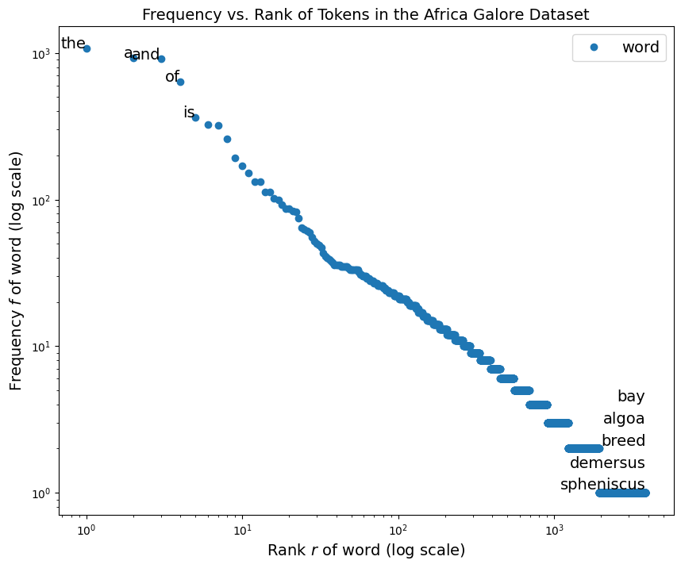
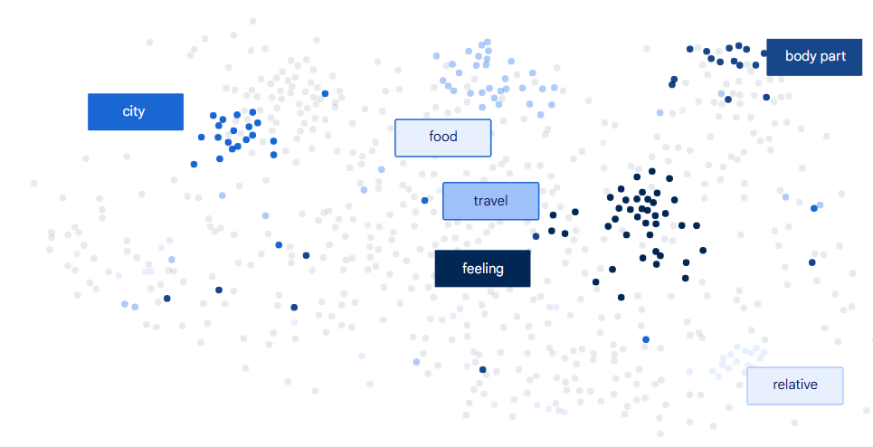

# 第二章 Represent Your Language Data

## 数据预处理(Preprocess)

我们的原始数据通常来自互联网，互联网上大多是 **HTML** 文档或者是 **Markdown** 文档，像是 **HTML** 文档，其中会存在诸如`<div>`、`<span>`等的 **HTML** 标签，这些标签对于我们想训练的模型来说，可能就没有什么意义，是多余的干扰项，为提高模型的训练效果，就需要移除这些干扰

- 比如 `<p>2026年2月1日的天气是晴天</p>`，这里面的`<p>`标签并没有为”2026年2月1日的天气是晴天“这句话提供额外的信息或说明，它的作用只是告诉浏览器这句话以段落的形式进行展示，因此我们就需要将其移除掉，避免干扰

但并非所有情况下都需要像前面所说的，要把 **HTML** 标签给“洗”掉，如果在训练一个对文章进行分类的模型时，这些标签就非常有用

- 比如我们可以直接通过识别和读取`<h1>`一级标题来快速进行对文章分类，像是`<h1>`、`<h2>`、`<li>`这些具有”语义“的标签让我们的模型可以快速提取特征并完成工作

总的来说，数据预处理并没有通用的规则，我们需要根据具体的场景去识别哪些数据是重要的，哪些数据是多余的。

对于常见的 **HTML** 文档，我们可以通过以下方式进行快速”清洗“

- 通过`<.*?>`**正则表达式**匹配成对或单独出现的 **HTML** 标签
  - `.`:表示匹配除换行符(“\n”)外的单个字符
  - `*`:表示匹配零个或多个符合前面匹配规则的内容，`.*`组合起来就是匹配任意长的字符串(尽可能多的匹配)
  - `?`:表示匹配只匹配至多一个符合前面匹配规则的内容(尽可能少的匹配)，如果不加`?`,`.*`会将`<p>hello</p>`匹配为一整体，加了就只会单独将`<p>`和`<\p>`匹配出来，里面的“hello”内容则不会被匹配
- 通过**直接替换**的方式将 **HTML** 的特殊字符给换成有意义的字符
  - 比如:
  - 将 `&nbsp;`替换成`" "`
  - 将`&amp;`替换成`&`
  - 将`&lt;`替换成`<`
  - 将`&gt;`替换成`>`

对于 **Unicode** 字符，我们可以通过类别筛选进行“清洗”，只保留我们需要的类型

- **Unicode** 字符通常有如下分类，一般保留`L`(文字)、`N`(数字)和`P`(标点符合)

  - | Category | Meaning         | Common sub-codes & examples                                  |
    | -------- | --------------- | ------------------------------------------------------------ |
    | **L\***  | Letter          | `Lu` = uppercase (A), `Ll` = lowercase (a), `Lt` = titlecase (Dž), `Lm` = modifier (ʰ), `Lo` = other letters (汉, ע) |
    | **N\***  | Number          | `Nd` = decimal digits (0-9, ٠–٩), `No` = other numbers (½, Ⅻ) |
    | **P\***  | Punctuation     | `Po` = other punctuation (!, ?), `Pd` = dash (—), `Ps`/`Pf`/`Pe` = start/final/end brackets |
    | **S\***  | Symbol          | `Sm` = math (±, √), `Sc` = currency (₦, $), `Sk` = modifier (ˆ), `So` = other symbols (😊, ⭐) |
    | **Z\***  | Separator       | `Zs` = space, `Zl` = line, `Zp` = paragraph                  |
    | **C\***  | Other / Control | `Cc` = control codes (newline, tab), `Cf` = formatting marks (zero-width joiner), `Cs` = surrogates, `Co`/`Cn` = private-use or unassigned |

## 分词(Tokenize)

对于文本来说，我们可以**以单词(词)**方式进行划分(**word-level** tokenization)也可以**以字母(字)**方式进行划分(**character-level** tokenization)的方式

对于文本“Hello world”

- 在以单词(词)方式进行划分时:
  - 对于英文来说，我们可以简单的通过空格来区分单词
  - 结果就是: {“hello”,“world”}
- 在以字母(字)方式进行划分时:
  - 结果就是: {“h”, “e”, “l”, “l”, “o”, “ ”, “w”, “o”, “r”, “l”, “d”}

通常来说，以单词(词)划分将会比以字母(字)划分得到更大的词汇集，因为字母(字)通常是**有限的**(比如英文字母就只有26个)，而单词是由字母组合而成，理论上是**无上限的**；但以单词(词)划分后得到的结果序列长度比以字母(字)划分后更小，在上述例子中，“hello world”经过以单词(词)划分后的结果序列长度为 **2**，而经过字母(字)划分得到的结果序列长度为 **11**，后者是前者的 5 倍之多

采用以字母(字)划分将带来过长的结果序列，而过长的结果序列将:

- 增加内存和计算消耗

采用以单词(词)划分将带来过长的词汇集，而过大的词汇集将:

- 增加模型训练的参数

而**以子词方式**(**sub-word** tokenization)划分可以很好的进行折中

以子词方式划分是将一个单词拆分成更小的具有意义的子词，比如“Adansonia”可能拆分成 -> “Ad”,“ans”, “onia”，这些更小的具有意义的子词是通过 **BPE** (Byte Pair Encoding)算法得到

**BPE** 算法过程:

1.  **初始化**: 将整个待处理的文本拆分成一个一个的字母(以字母划分)，将空格替换成一个特殊符号(比如`</w>`)，这些字母和特殊符合将添加到词汇集中(每个字符在集中唯一)

   - 示例:

     - 划分后:

     ```bash
     ['T', 'h', 'e', '</w>']
     ['L', 'a', 'g', 'o', 's', '</w>']
     ['a', 'i', 'r', '</w>']
     ['w', 'a', 's', '</w>']
     ['t', 'h', 'i', 'c', 'k', '</w>']
     ['w', 'i', 't', 'h', '</w>']
     ['h', 'u', 'm', 'i', 'd', 'i', 't', 'y', ',', '</w>']
     ['b', 'u', 't', '</w>']
     ['t', 'h', 'e', '</w>']
     ['e', 'n', 'e', 'r', 'g', 'y', '</w>']
     ...
     ```

     - 词汇集:

     ```bash
     {'4', 'W', ')', '5', 't', 'y', 'z', 'V', 'k', 'O', 'e', '”', ':', '2', 'q', '1', '"', 'w', 'a', 'M', '“', 'm', 'l', 'g', 'P', '—', '7', 'G', 'U', 'T', ';', 'K', '3', 'd', 'Z', 'h', 'j', 'F', 'b', 'H', "'", 'X', 'i', 'R', 'A', '9', 'L', 'E', 'J', '/', 'u', 'p', 'o', 'c', '6', 'C', '(', '</w>', '.', '?', '°', 'é', 'S', 'n', 'Y', 'B', 'I', 'v', 'f', 'N', '8', 'x', ',', 'D', 'r', 's', '-', '0'}
     ```

      

2. **计数**: 将相邻的两个字符(可能是两个字母，也可能是两个子词)两两配对(Pair 操作)组成一个新的字符，然后统计每个两两配对的字符的出现个数

   - 示例:

     - 计数结果:

     ```bash
     # ({配对}, {出现次数})
     (('e', '</w>'), 2639)
     (('d', '</w>'), 2146)
     (('s', '</w>'), 2078) 
     (('a', 'n'), 1883)
     (('t', 'h'), 1869)
     (('i', 'n'), 1822)
     (('h', 'e'), 1735)
     ((',', '</w>'), 1710)
     (('e', 'r'), 1359)
     (('n', 'd'), 1305)
     ...
     ```

     

3.  **合并**: 选择上一步得到的最频繁出现的字符配对，假设是(p, q)，合并成一个词“pq”并添加到词汇集中

   - 示例:

     - 假设本轮中`(‘e’, ‘</w>’)`配对出现最多，添加到词汇集:

     ```bash
     {'4', 'W', ')', '5', 't', 'y', 'z', 'V', 'k', 'O', 'e', '”', ':', '2', 'q', '1', '"', 'w', 'a', 'M', '“', 'm', 'l', 'g', 'P', '—', '7', 'G', 'U', 'T', ';', 'K', '3', 'd', 'Z', 'h', 'j', 'F', 'b', 'H', "'", 'X', 'i', 'R', 'A', '9', 'L', 'E', 'J', '/', 'u', 'p', 'o', 'c', '6', 'C', '(', '</w>', '.', '?', '°', 'é', 'S', 'n', 'Y', 'B', 'I', 'v', 'f', 'N', '8', 'x', ',', 'D', 'r', 's', '-', '0', 'e</w>'}
     ```

     

4.  **替换**: 然后使用新词“pq”替换待处理文本中相邻的 (p, q)对

   - 示例:

     - 假设本轮中`(‘e’, ‘</w>’)`配对出现最多，替换后:

     ```bash
     ['T', 'h', 'e</w>']
     ['L', 'a', 'g', 'o', 's', '</w>']
     ['a', 'i', 'r', '</w>']
     ['w', 'a', 's', '</w>']
     ['t', 'h', 'i', 'c', 'k', '</w>']
     ['w', 'i', 't', 'h', '</w>']
     ['h', 'u', 'm', 'i', 'd', 'i', 't', 'y', ',', '</w>']
     ['b', 'u', 't', '</w>']
     ['t', 'h', 'e</w>']
     ['e', 'n', 'e', 'r', 'g', 'y', '</w>'] 
     ...
     ```

     

5.  **重复**: 重复 2 - 4 步，直到达到指定的词汇集大小

> **Zipf** 定律:
>
> 在极大多数情况下，我们会发现，分出来的词，词的出现频率与其排名(按照出现频率进行排序)成反比
>
> - 公式: 
>   $$
>   f \propto \frac{1}{r}
>   $$
>
> 只有少数词是常见的，而大多数词是罕见的，为了更直观的呈现单词的频率分布，会以取对数的方式进行描述，呈现近似一条简单的直线, 图示：
>
> 

## 向量化(Embedding)

经过前面的数据预处理和分词，原来混乱、机器无法理解的语言文本会被转换成一系列的 **id** 数字，比如 [5021, 234, 121, ...], 但仅仅只是数字，并不能让机器去理解每个数字代表着什么，也更不能区分数字所映射的词之前的相似程度；通过向量化，使用一个**多维的向量**替换这个 **id** 数字来描述词，就能很好解决这个问题

向量化后的效果:

```
Token ID 8971 (“king”) → [0.91, 0.85, -0.12, ...]

Token ID 91024 (“queen”) → [0.89, -0.78, -0.11, ...]

Token ID 87676 (“zebra”) → [-0.54, 0.23, 0.88, ...]
```

每个 token (词)，被赋予了一个在多维坐标系中唯一的向量，这个多维坐标系中的每一个”轴“分别代表着不同的”意义“，比如颜色、情感、词性等，维数可达成百上千；意义相近的词会形成一个集群，互相挨得比较近

通过计算两个 token (词) 的向量 **cos** 三角函数值(限定范围在 **-1 ~ 1**，进行**归一化**是为了解决可能出现数值过大或过小的问题), 假设 u, v 分别是两个 token 的向量值

- 公式:

  - $$
    cosine(u, v) = \frac{u ⋅ v}{ ||u|| ||v||}
    $$

  - 其中:

    - 点积公式:

    $$
    u ⋅ v = \sum_{k=1}^{K}u_kv_k
    $$

    - 模长公式:

    $$
    || u || = \sqrt{\sum_{k=1}^{K}u_k^2}
    $$

    

通过计算得到的 **cos** 值可以判断这两个 token 是否相似:

- 如果值**大于 0**(向量夹角小于 90°)，那么这两个词意义是相近的
- 如果值**等于 0**(向量夹角等于 90°)，那么这两个词意义毫无关系
- 如果值**小于 0**(向量夹角大于 90°)，那么这两个词意义是相反的

图示:


在模型训练不断调整参数降低 **Loss** 过程中，同时也会不断调整每个词的向量，使得意义相近的词越来越靠近，最后会形成词组集群，图示:


