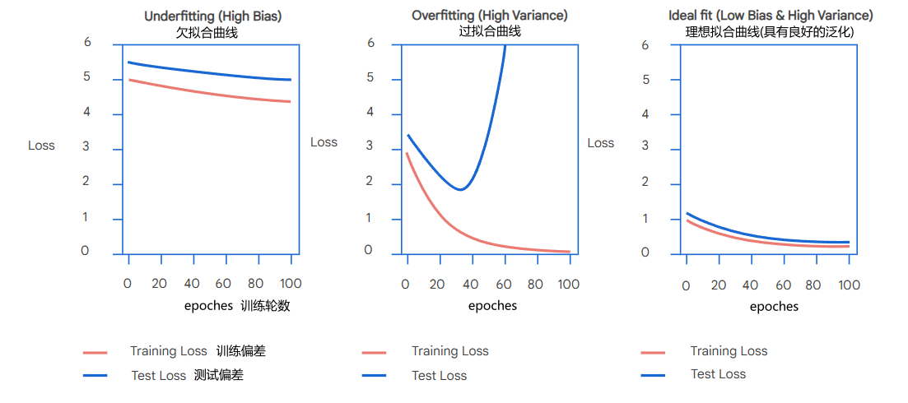
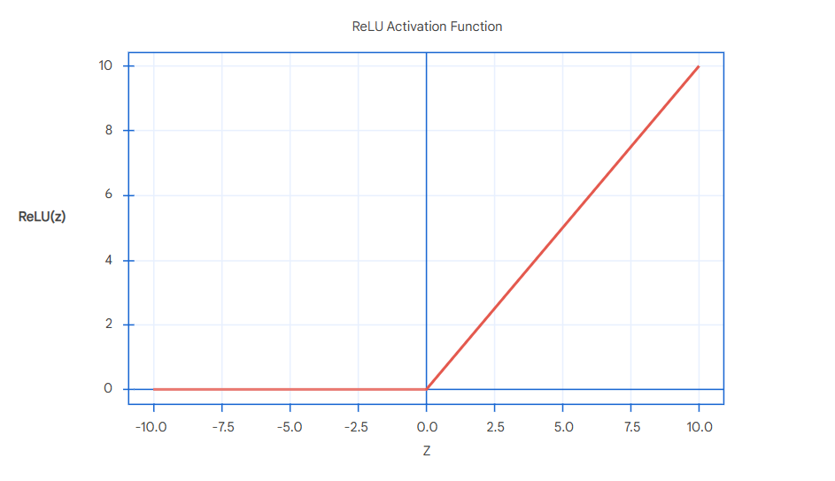
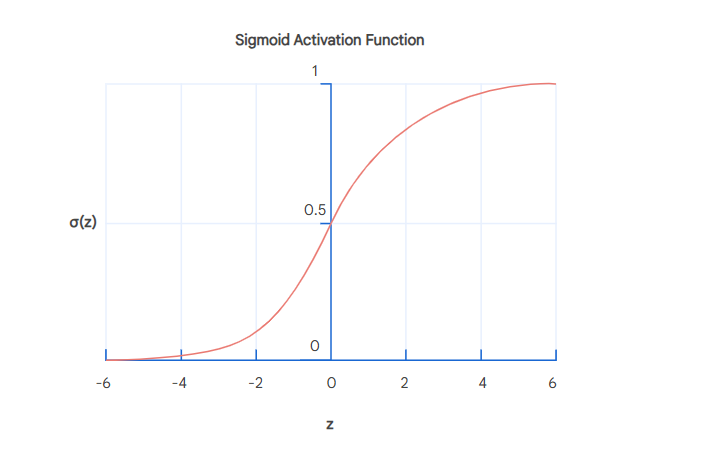

# 第三章 Design And Train Neural Networks

## 信号和噪声(Signal And Nosie)

**信号**指的是与场景相关并且符合预期的内容；

**噪声**指的是与场景无关甚至会干扰理解的内容；

例如，当人们询问智能客服机器人一个“我新买的夹克是否可以进行退货”问题时，机器人回答“我们所有的夹克都支持30天内退货，并且可以在低温模式下清洗”，前面的一句话“我们所有的夹克都支持30天退货”与人们想询问的内容贴切，是符合预期的，那么它就是**信号**；而后面一句“并且可以在低温模式下清洗”则相反，让人感到疑惑，并且还带有些误导性(人们可能会错误的理解为只有可以在低温模式下清洗的夹克才支持30天内退货)，那么它就是**噪声**，这个噪声的产生很大可能是因为训练数据中缺少足够的与夹克相关的内容，同时，模型错误的学习了偶然出现的个例组合(“我们的夹克支持低温模式下清洗”)

## 泛化和拟合(Generalization And Fitting)

**泛化(Generalization)**指的是模型运用已有的知识对新的场景或从未见过的数据进行预测的能力，有良好泛化的模型不仅可以向用户返回合适的信息（信号），还可以忽略掉不相干的信息（噪音），相反，如果模型没有较好的泛化能力，那么它就可能会输出噪声，向用户提供错误的信息

**欠拟合(Underfitting)**指的是模型训练训练次数过少，导致模型出现无法输出有效、有意义信息的情况，即模型没有充分的进行学习

**过拟合(Overfitting)**指的是模型训练训练次数过多，导致模型出现在类似的场景中结果很好，但在新的场景结果很差的情况(输出了噪音)，即模型过度学习，把错误的信息组合也学了进去

为了得到良好的泛化能力，通常会将数据集进行拆分：

- 将 80% - 90% 的数据作为训练数据
- 将 10% - 20% 的数据作为测试数据

在完成训练后，使用测试数据对模型进行检测，好比于老师给学生进行考试一样，检查模型的学习效果

我们可以通过下面曲线来判断模型的训练效果:

- 欠拟合曲线：训练偏差和测试偏差随着训练轮数增加始终保持是一个比较高的值，并且变化幅度小，意味着模型不能输出有效、有意义的结果
- 过拟合曲线：训练偏差随着训练偏差逐渐减少，最终保持一个比较低的值，但测试偏差则是在降低到一定值后会大幅增加，测试效果急剧下降，意味着模型的泛化能力差
- 理想拟合曲线：训练偏差和测试偏差随着训练次数增加而减小，并且整体偏差都较小，意味着模型有良好的泛化能力，当模型训练效果达到理想拟合时为最佳

## 多层感知器(MLP, **Multilayer Perceptron**)

**MLP**由以下三个层级组成:

- 输入层(Input Layer): 输入 embeddings 矩阵
- 隐藏层(Hiden Layers): **最主要的层级**，可有多层，进行一系列的计算，每层的计算结果都会作为下一层的输入
- 输出层(Output Layer): 输出预测结果

在隐藏层层级中，每一层都会有若干个“人造神经元”，同一层的神经元相互独立，独立接收来自上一层的输出，然后进行计算，输出到下一层的神经元

在神经元内部会做这样的计算:

1. 计算权重和:

   - $$
     z = w ⋅ x +b = \sum_{i=1}^n(w_ix_i)+b = w_1x_1 + w_2x_2 + w_3x_3 + ... + w_nx_n + b
     $$

   - **x**:  为输入向量，指各维度的值

   - **w**: 为权重向量，指各维度的权重值

   - **b**:  为偏差值，用于调整输出结果，与输入的参数无关

   - **z**:  为权重和，将输入向量和权重向量的点积加上偏差得到的结果

2. 调用激活函数:

   - $$
     y = g(z)
     $$

   - **y**: 为神经元输出的结果，也就是预测值

   - 常见的激活函数:

     - **ReLU(Rectified Linear Unit)**:  一个简单且流行使用的激活函数，当输入的权重和(z)小于0时取0，大于0时取输入值，即权重和

       - $$
         \text{ReLU}(z) = \begin{cases} 0 & \text{if } z \leq 0 \\ z & \text{if } z > 0 \end{cases}
         $$

       - 

     - **Sigmoid**: 输出结果介于 0 - 1 之间，当输入的权重和大于 0.5 时取值大于0，当小于 0.5 时取值小于0

       - $$
         \sigma(z) = \frac{1}{1 + e^{-z}}
         $$

       - 

     - **SoftMax**： 输出第 i 个类别在 K 个类别中的概率，通常在多类别分类中使用，放在最后一层使用

       - $$
         \text{SoftMax}(z_i) = \frac{e^{z_i}}{\sum_{j=1}^{K} e^{z_j}}
         $$

 神经元计算流程示意图:

- 

神经网络层级示意图:

- 

## 过拟合优化手段(Mitigate Overfitting)

### **Hyperparameters:** 

Hyperparameters 指的是在模型训练前设定的配置参数，包括：

- 层数
- 每层神经元数量

为了更好的去判断所设的 Hyperparameters 是否合适，就得在额外将数据集多拆分一个验证集，以验证配置参数的合理性，通常如下拆分:

- 训练集: 占 70%-80%
- 验证集: 占 10%-15%，类比于”平时考试“
- 测试集: 占 10%-20%，类比于”期末考试“

### 优化手段:

**容量控制(Capacity Control)**:

- 模型的容量指的是模型学习复杂模式的能力，容量由模型的层数和神经元数决定，容量与这二者的数量成正比，适当的容量可以让模型可以学习更复杂的模式和内容，但过大的容量则会导致模型学习过多的噪声，因此需要对容量做适当的控制，即对层数和每层的神经元数量进行控制，这也是应对过拟合最直接的手段

**正则化(Regularization)**:

- 正则化通常采用的权重衰减(Weight Decay)这个方式进行优化，权重衰减通常使用 L2 正则，简单来说就是惩罚过大的权重值（直接设置为更小值），使得输出更加平缓

**神经元失活(Dropout)**:

- 通过直接随机丢弃一些神经元的输出结果（直接将输出设置为0）来优化过拟合的情况

**检查点(Checkpoint)**:

- 在训练过程中，记录在验证集效果最好的参数，这个方式通常和早停止配合使用

**早停止(Early Stopping)**:

- 模型在验证集中如果在预定的周期(**epoch**)数内(称为 **patience** )效果不再得到提升时，直接停止训练，取先前记录的效果最好的参数作为结果

## 梯度下降(Gradients Descent)

梯度下降过程简单来说就是模型在训练过程中**自动调整**权重向量参数不断**向偏差(Loss)降低**的方向进行

在真实的训练过程中，数据集往往是相当大的，如果对数据集中的每个数据进行做梯度下降，那么这个过程会相当耗时，以及占用相当大的内存，通过采用**随机梯度下降(SGD, Stochastic gradient descent)**就可以很好的解决这个问题，梯度下降不再使用完整的数据集，而是使用小批量的数据进行完成权重的更新，这样就可以大大提高训练的效率