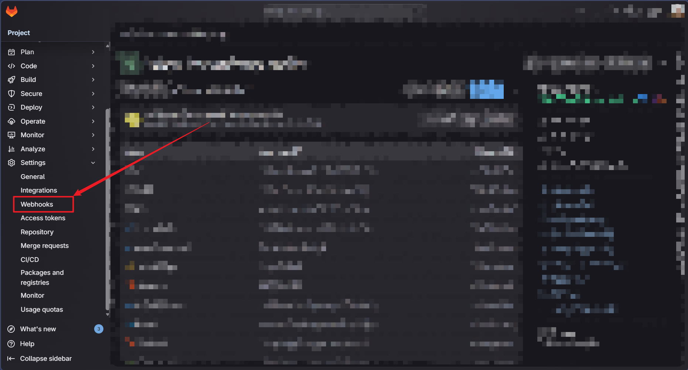
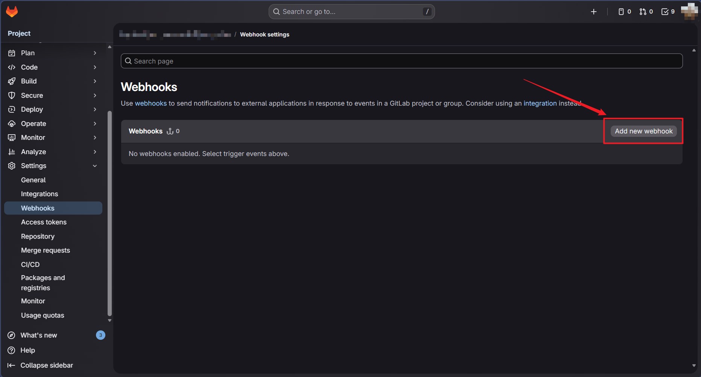
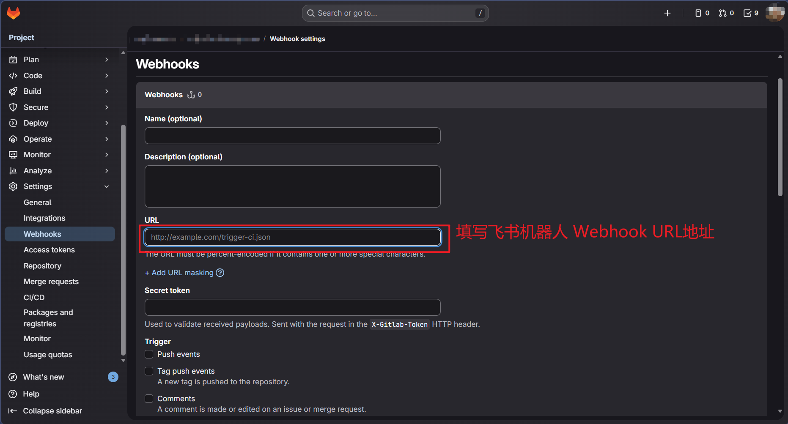
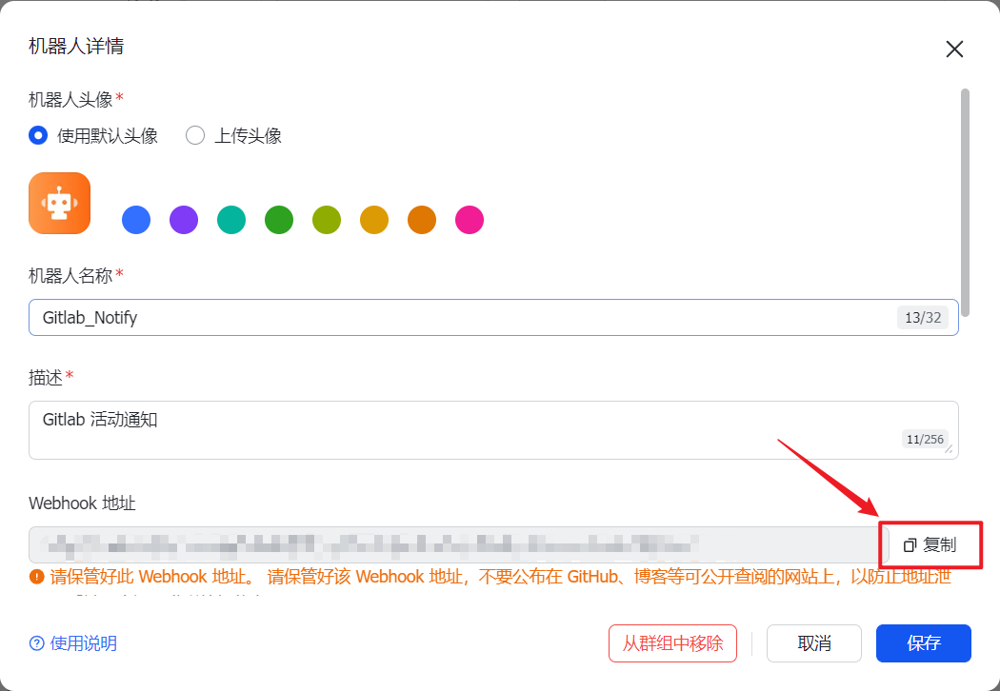
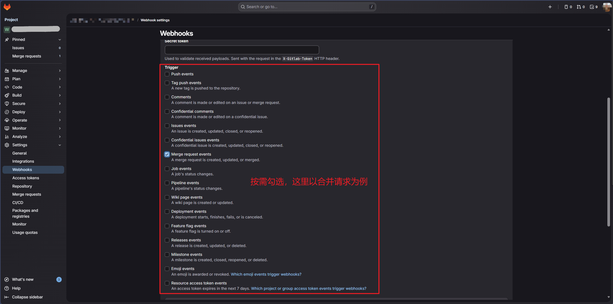
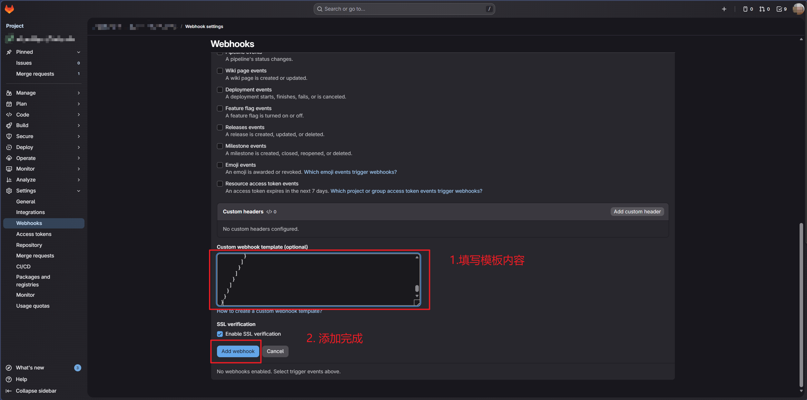
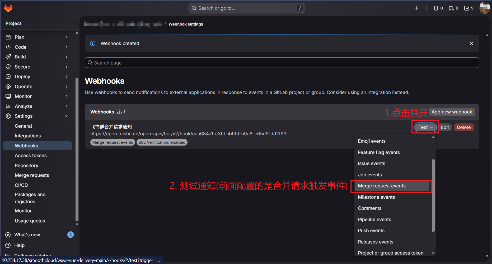
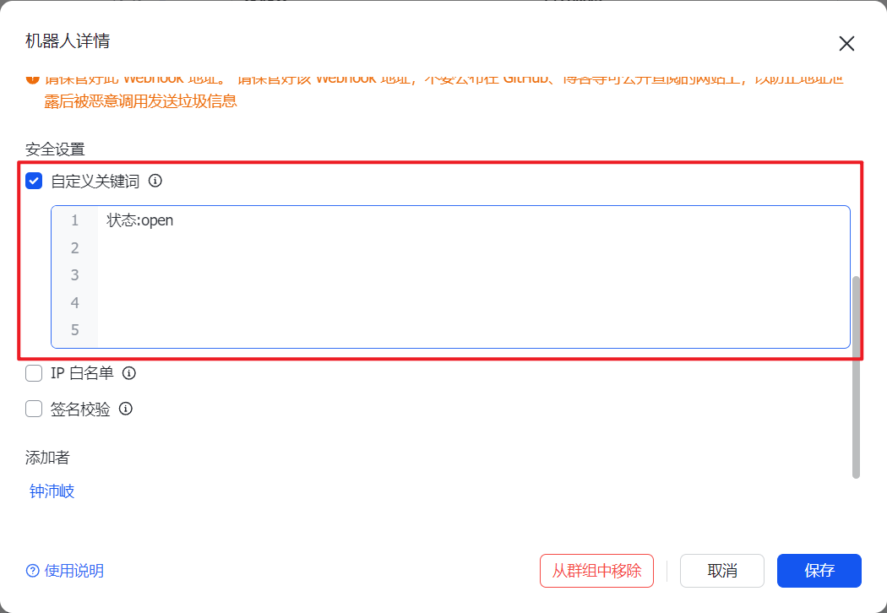

> 前置需要:
>
> - 需要拥有仓库的访问和管理权限(至少是`Maintainer`维护者角色的权限)
> - 需要有一个飞书群的机器人

## 访问 Gitlab 仓库 Webhooks 配置页面

做左侧侧边栏展开`Settings`（如果没有该选项，则说明当前账号权限不足, 需要先获取权限)



## 创建一个新的 webhook



## 填写机器人 webhook 地址



> webhook 地址在飞书群上创建机器人后，直接复制 webhook  地址:
>
> 

## 勾选需要触发通知的内容



## 填写自定义消息模板

> PS: 飞书有自己的消息模板要求，所以需要进行单独配置

以飞书卡片交互消息通知类型为例(可直接拷贝套用):

> 飞书文档: [自定义机器人使用指南 - 开发指南 - 开发文档 - 飞书开放平台](https://open.feishu.cn/document/client-docs/bot-v3/add-custom-bot?lang=zh-CN#478cb64f)

gitlab 填充字段内容格式： `{{json字段.属性内容}}`（与获取 json 内容类似) 如 `{{object_attributes.source_branch}}` 获取合并请求源分支；

(合并请求通知有哪些字段可以参考下方提供的示例内容，也可以直接访问 gitlab 文档具体查看: [Webhook events | GitLab Docs](https://docs.gitlab.com/18.8/user/project/integrations/webhook_events/) ）

```json
{
  "msg_type": "interactive",
  "card": {
    "schema": "2.0",
    "config": { "update_multi": true },
    "header": {
      "title": { "tag": "plain_text", "content": "🔀 Merge Request !{{object_attributes.iid}} | 状态:{{object_attributes.action}}" },
      "subtitle": { "tag": "plain_text", "content": "{{project.path_with_namespace}} · {{user.name}}" },
      "template": "blue",
      "padding": "12px 12px 12px 12px"
    },
    "body": {
      "direction": "vertical",
      "padding": "12px 12px 12px 12px",
      "elements": [
        {
          "tag": "markdown",
          "content": "**[{{object_attributes.title}}]({{object_attributes.url}})**\n`{{object_attributes.source_branch}}` → `{{object_attributes.target_branch}}`",
          "text_size": "heading"
        },
        {
          "tag": "markdown",
          "content": "{{object_attributes.description}}",
          "text_size": "normal"
        },
        { "tag": "hr"},
        {
          "tag": "column_set",
          "flex_mode": "none",
          "horizontal_spacing": "16px",
          "columns": [
            {
              "tag": "column",
              "width": "weighted",
              "weight": 1,
              "elements": [
                { "tag": "markdown", "content": "**发起人**\n@{{user.name}}" }
              ]
            },
            {
              "tag": "column",
              "width": "weighted",
              "weight": 1,
              "elements": [
                { "tag": "markdown", "content": "**合并状态**\n{{object_attributes.merge_status}}" }
              ]
            }
          ]
        },
        { "tag": "hr" },
        {
          "tag": "column_set",
          "flex_mode": "none",
          "horizontal_spacing": "8px",
          "columns": [
            {
              "tag": "column",
              "width": "auto",
              "elements": [
                {
                  "tag": "button",
                  "text": { "tag": "plain_text", "content": "查看 MR" },
                  "type": "primary",
                  "size": "medium",
                  "behaviors": [{ "type": "open_url", "default_url": "{{object_attributes.url}}" }]
                }
              ]
            },
            {
              "tag": "column",
              "width": "auto",
              "elements": [
                {
                  "tag": "button",
                  "text": { "tag": "plain_text", "content": "查看项目" },
                  "type": "default",
                  "size": "medium",
                  "behaviors": [{ "type": "open_url", "default_url": "{{project.web_url}}" }]
                }
              ]
            }
          ]
        }
      ]
    }
  }
}
```

> 如果需要额外添加 Gitlab Merge Event 的消息，可参考以下的字段内容(**注意:** gitlab 不支持渲染数组内容，即无法正常将 `assignees` 或 `reviewers` 渲染成一个数组字符串，更无法读取数组里面的元素，类似 `assignees[0]` 或 `assignees.0.name`):
>
> ```json
> {
>   "object_kind": "merge_request",
>   "event_type": "merge_request",
>   "user": {
>     "id": 1,
>     "name": "Administrator",
>     "username": "root",
>     "avatar_url": "http://www.gravatar.com/avatar/e64c7d89f26bd1972efa854d13d7dd61?s=40\u0026d=identicon",
>     "email": "admin@example.com"
>   },
>   "project": {
>     "id": 1,
>     "name":"Gitlab Test",
>     "description":"Aut reprehenderit ut est.",
>     "web_url":"http://example.com/gitlabhq/gitlab-test",
>     "avatar_url":null,
>     "git_ssh_url":"git@example.com:gitlabhq/gitlab-test.git",
>     "git_http_url":"http://example.com/gitlabhq/gitlab-test.git",
>     "namespace":"GitlabHQ",
>     "visibility_level":20,
>     "path_with_namespace":"gitlabhq/gitlab-test",
>     "default_branch":"master",
>     "ci_config_path":"",
>     "homepage":"http://example.com/gitlabhq/gitlab-test",
>     "url":"http://example.com/gitlabhq/gitlab-test.git",
>     "ssh_url":"git@example.com:gitlabhq/gitlab-test.git",
>     "http_url":"http://example.com/gitlabhq/gitlab-test.git"
>   },
>   "repository": {
>     "name": "Gitlab Test",
>     "url": "http://example.com/gitlabhq/gitlab-test.git",
>     "description": "Aut reprehenderit ut est.",
>     "homepage": "http://example.com/gitlabhq/gitlab-test"
>   },
>   "object_attributes": {
>     "id": 99,
>     "iid": 1,
>     "target_branch": "master",
>     "source_branch": "ms-viewport",
>     "source_project_id": 14,
>     "author_id": 51,
>     "assignee_ids": [6],
>     "assignee_id": 6,
>     "reviewer_ids": [6],
>     "title": "MS-Viewport",
>     "created_at": "2013-12-03T17:23:34Z",
>     "updated_at": "2013-12-03T17:23:34Z",
>     "last_edited_at": "2013-12-03T17:23:34Z",
>     "last_edited_by_id": 1,
>     "milestone_id": null,
>     "state_id": 1,
>     "state": "opened",
>     "blocking_discussions_resolved": true,
>     "work_in_progress": false,
>     "draft": false,
>     "first_contribution": true,
>     "merge_status": "unchecked",
>     "target_project_id": 14,
>     "description": "",
>     "prepared_at": "2013-12-03T19:23:34Z",
>     "total_time_spent": 1800,
>     "time_change": 30,
>     "human_total_time_spent": "30m",
>     "human_time_change": "30s",
>     "human_time_estimate": "30m",
>     "url": "http://example.com/diaspora/merge_requests/1",
>     "source": {
>       "name":"Awesome Project",
>       "description":"Aut reprehenderit ut est.",
>       "web_url":"http://example.com/awesome_space/awesome_project",
>       "avatar_url":null,
>       "git_ssh_url":"git@example.com:awesome_space/awesome_project.git",
>       "git_http_url":"http://example.com/awesome_space/awesome_project.git",
>       "namespace":"Awesome Space",
>       "visibility_level":20,
>       "path_with_namespace":"awesome_space/awesome_project",
>       "default_branch":"master",
>       "homepage":"http://example.com/awesome_space/awesome_project",
>       "url":"http://example.com/awesome_space/awesome_project.git",
>       "ssh_url":"git@example.com:awesome_space/awesome_project.git",
>       "http_url":"http://example.com/awesome_space/awesome_project.git"
>     },
>     "target": {
>       "name":"Awesome Project",
>       "description":"Aut reprehenderit ut est.",
>       "web_url":"http://example.com/awesome_space/awesome_project",
>       "avatar_url":null,
>       "git_ssh_url":"git@example.com:awesome_space/awesome_project.git",
>       "git_http_url":"http://example.com/awesome_space/awesome_project.git",
>       "namespace":"Awesome Space",
>       "visibility_level":20,
>       "path_with_namespace":"awesome_space/awesome_project",
>       "default_branch":"master",
>       "homepage":"http://example.com/awesome_space/awesome_project",
>       "url":"http://example.com/awesome_space/awesome_project.git",
>       "ssh_url":"git@example.com:awesome_space/awesome_project.git",
>       "http_url":"http://example.com/awesome_space/awesome_project.git"
>     },
>     "last_commit": {
>       "id": "da1560886d4f094c3e6c9ef40349f7d38b5d27d7",
>       "message": "fixed readme",
>       "title": "Update file README.md",
>       "timestamp": "2012-01-03T23:36:29+02:00",
>       "url": "http://example.com/awesome_space/awesome_project/commits/da1560886d4f094c3e6c9ef40349f7d38b5d27d7",
>       "author": {
>         "name": "GitLab dev user",
>         "email": "gitlabdev@dv6700.(none)"
>       }
>     },
>     "labels": [{
>       "id": 206,
>       "title": "API",
>       "color": "#ffffff",
>       "project_id": 14,
>       "created_at": "2013-12-03T17:15:43Z",
>       "updated_at": "2013-12-03T17:15:43Z",
>       "template": false,
>       "description": "API related issues",
>       "type": "ProjectLabel",
>       "group_id": 41
>     }],
>     "action": "open",
>     "detailed_merge_status": "mergeable"
>   },
>   "labels": [{
>     "id": 206,
>     "title": "API",
>     "color": "#ffffff",
>     "project_id": 14,
>     "created_at": "2013-12-03T17:15:43Z",
>     "updated_at": "2013-12-03T17:15:43Z",
>     "template": false,
>     "description": "API related issues",
>     "type": "ProjectLabel",
>     "group_id": 41
>   }],
>   "changes": {
>     "updated_by_id": {
>       "previous": null,
>       "current": 1
>     },
>     "draft": {
>       "previous": true,
>       "current": false
>     },
>     "updated_at": {
>       "previous": "2017-09-15 16:50:55 UTC",
>       "current":"2017-09-15 16:52:00 UTC"
>     },
>     "labels": {
>       "previous": [{
>         "id": 206,
>         "title": "API",
>         "color": "#ffffff",
>         "project_id": 14,
>         "created_at": "2013-12-03T17:15:43Z",
>         "updated_at": "2013-12-03T17:15:43Z",
>         "template": false,
>         "description": "API related issues",
>         "type": "ProjectLabel",
>         "group_id": 41
>       }],
>       "current": [{
>         "id": 205,
>         "title": "Platform",
>         "color": "#123123",
>         "project_id": 14,
>         "created_at": "2013-12-03T17:15:43Z",
>         "updated_at": "2013-12-03T17:15:43Z",
>         "template": false,
>         "description": "Platform related issues",
>         "type": "ProjectLabel",
>         "group_id": 41
>       }]
>     },
>     "last_edited_at": {
>       "previous": null,
>       "current": "2023-03-15 00:00:10 UTC"
>     },
>     "last_edited_by_id": {
>       "previous": null,
>       "current": 3278533
>     }
>   },
>   "assignees": [
>     {
>       "id": 6,
>       "name": "User1",
>       "username": "user1",
>       "avatar_url": "http://www.gravatar.com/avatar/e64c7d89f26bd1972efa854d13d7dd61?s=40\u0026d=identicon"
>     }
>   ],
>   "reviewers": [
>     {
>       "id": 6,
>       "name": "User1",
>       "username": "user1",
>       "state": "unreviewed",
>       "avatar_url": "http://www.gravatar.com/avatar/e64c7d89f26bd1972efa854d13d7dd61?s=40\u0026d=identicon"
>     }
>   ]
> }
> ```



## 测试通知



## 配置通知过滤

在飞书群机器人上设置 **自定义关键词**， 这里配置只允许 open 的合并请求通知


